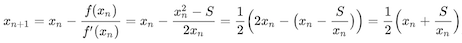

# libsqrt
`libsqrt` calculates an approximation of the [square root](https://en.wikipedia.org/wiki/Square_root).

### Method
The approximation is done using [Babylonian method](https://en.wikipedia.org/wiki/Methods_of_computing_square_roots)

.

The first value in the series is obtained using [Rough estimation](https://en.wikipedia.org/wiki/Methods_of_computing_square_roots).

### Dependencies
* [libexponent](https://github.com/mathinjenkins/libexponent)

### Build
* `git clone git@github.com:mathinjenkins/libsqrt.git`
* `cd libsqrt`
* `mkdir build && cd build`
* `cmake ../`
* `make`
* `./test/sqrt_test`

### License
[MIT License](https://github.com/mathinjenkins/libsqrt/blob/master/LICENSE)
